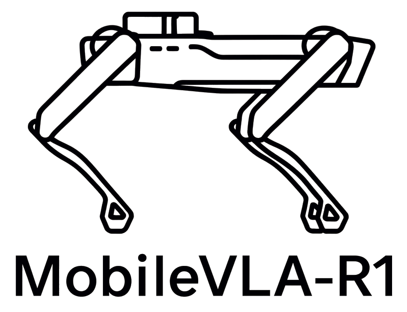
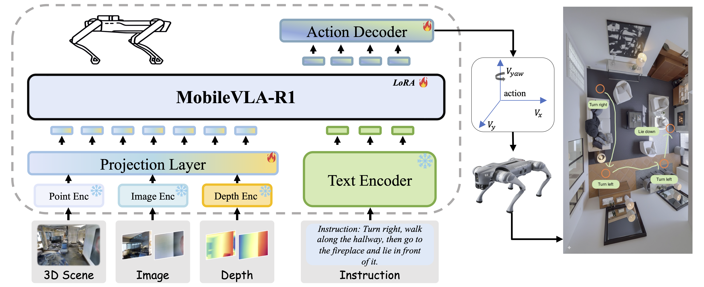

#  MobileVLA-R1: Reinforcing Vision-Language-Action for Mobile Robots

This is the official repository for the paper:
> **MobileVLA-R1: Reinforcing Vision-Language-Action for Mobile Robots**
>
> [Ting Huang](https://github.com/Believeht029)\*, [Dongjian Li]()\*, [Rui Yang]()\*, [Zeyu Zhang](https://steve-zeyu-zhang.github.io/)\*<sup>†</sup>, [Zida Yang](), and [Hao Tang](https://ha0tang.github.io/)<sup>#</sup>
>
> \*Equal contribution. <sup>†</sup>Project lead. <sup>#</sup>Corresponding author.
>
> ### [Paper](https://arxiv.org/abs/2511.17889) | [Website](https://aigeeksgroup.github.io/MobileVLA-R1/) | [Data](https://huggingface.co/datasets/AIGeeksGroup/MobileVLA-CoT) | [Models](https://huggingface.co/AIGeeksGroup/MobileVLA-R1) | [HF Paper](https://huggingface.co/papers/2511.17889)


https://github.com/user-attachments/assets/b167ebe6-cd72-470f-9b54-07e6e0989a4e


## ✏️ Citation
If you find our code or paper helpful, please consider starring ⭐ us and citing:
```bibtex
@article{huang2025mobile,
      title={MobileVLA-R1: Reinforcing Vision-Language-Action for Mobile Robots}, 
      author={Ting, Huang and Dongjian, Li and Rui, Yang and Zeyu, Zhang and Zida, Yang and Hao, Tang},
      journal={arXiv preprint arXiv:2511.17889},
      year={2025}
}
```

---

## 🏃 Intro MobileVLA-R1
MobileVLA-R1 enables robust real-world quadruped control by unifying language reasoning and continuous action through structured CoT alignment and GRPO training.

Grounding natural-language instructions into continuous control for quadruped robots remains a fundamental challenge in vision language action.
Existing methods struggle to bridge high-level semantic reasoning and low-level actuation, leading to unstable grounding and weak generalization in the real-world.
To address these issues, we present MobileVLA-R1, a unified vision–language–action framework that enables explicit reasoning and continuous control for quadruped robots.
We construct MobileVLA-CoT, a large-scale dataset of multi-granularity CoT for embodied trajectories, providing structured reasoning supervision for alignment.
Built upon this foundation, we introduce a two-stage training paradigm that combines supervised CoT alignment with GRPO reinforcement learning to enhance reasoning consistency, control stability, and long-horizon execution.
Extensive evaluations on VLN and VLA tasks demonstrate superior performance over strong baselines, with approximately a 5\% improvement.
Real-world deployment on a quadruped robot validates robust performance in complex environments.




## TODO List

- [x] Upload our paper to arXiv and build project pages.
- [x] Release MobileVLA-CoT dataset.
- [ ] Upload the code.


## 🌟 Star History

[](https://www.star-history.com/#AIGeeksGroup/MobileVLA-R1&type=date&legend=top-left)

## 😘 Acknowledgement
We thank the authors of [Qwen](https://github.com/QwenLM/Qwen), [NaVILA](https://github.com/AnjieCheng/NaVILA) and [DeepSeek-Math](https://github.com/deepseek-ai/DeepSeek-Math) for their open-source code.
