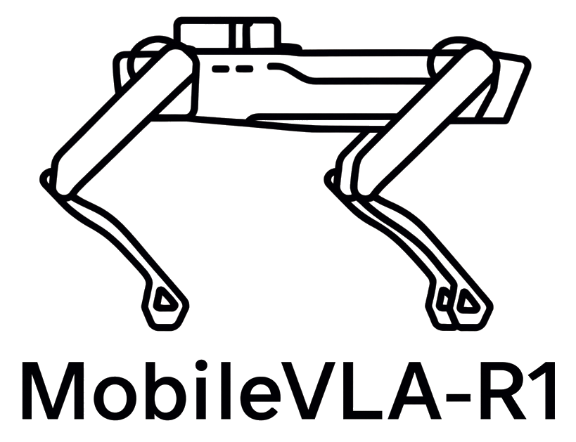
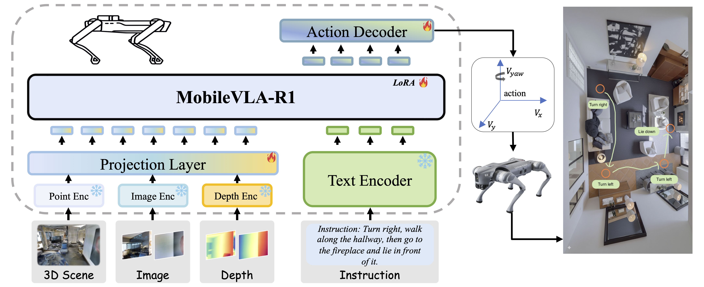

#  MobileVLA-R1: Reinforcing Vision-Language-Action for Mobile Robots

> [!NOTE]
> [**MobileVLA-R1 2.0**](https://aigeeksgroup.github.io/MobileVLA-R1-2.0/) is out! Structured reasoning and GRPO bring more reliable mobile robot control. 🤖


This is the official repository for the paper:
> **MobileVLA-R1: Reinforcing Vision-Language-Action for Mobile Robots**
>
> [Ting Huang](https://github.com/Believeht029)\*, [Dongjian Li]()\*, [Rui Yang]()\*, [Zeyu Zhang](https://steve-zeyu-zhang.github.io/)\*<sup>†</sup>, [Zida Yang](), and [Hao Tang](https://ha0tang.github.io/)<sup>#</sup>
>
> \*Equal contribution. <sup>†</sup>Project lead. <sup>#</sup>Corresponding author.
>
> ***ECCV 2026***
> 
> ### [Paper](https://arxiv.org/abs/2511.17889) | [Website](https://aigeeksgroup.github.io/MobileVLA-R1/) | [Data](https://huggingface.co/datasets/AIGeeksGroup/MobileVLA-CoT) | [Models](https://huggingface.co/AIGeeksGroup/MobileVLA-R1) | [HF Paper](https://huggingface.co/papers/2511.17889)


https://github.com/user-attachments/assets/b167ebe6-cd72-470f-9b54-07e6e0989a4e


## ✏️ Citation
If you find our code or paper helpful, please consider starring ⭐ us and citing:
```bibtex
@article{huang2025mobilevla,
  title={MobileVLA-R1: Reinforcing Vision-Language-Action for Mobile Robots},
  author={Huang, Ting and Li, Dongjian and Yang, Rui and Zhang, Zeyu and Yang, Zida and Tang, Hao},
  journal={arXiv preprint arXiv:2511.17889},
  year={2025}
}
```

---

## 🏃 Intro MobileVLA-R1
MobileVLA-R1 enables robust real-world quadruped control by unifying language reasoning and continuous action through structured CoT alignment and GRPO training.

Grounding natural-language instructions into continuous control for quadruped robots remains a fundamental challenge in vision language action.
Existing methods struggle to bridge high-level semantic reasoning and low-level actuation, leading to unstable grounding and weak generalization in the real-world.
To address these issues, we present MobileVLA-R1, a unified vision–language–action framework that enables explicit reasoning and continuous control for quadruped robots.
We construct MobileVLA-CoT, a large-scale dataset of multi-granularity CoT for embodied trajectories, providing structured reasoning supervision for alignment.
Built upon this foundation, we introduce a two-stage training paradigm that combines supervised CoT alignment with GRPO reinforcement learning to enhance reasoning consistency, control stability, and long-horizon execution.
Extensive evaluations on VLN and VLA tasks demonstrate superior performance over strong baselines, with approximately a 5\% improvement.
Real-world deployment on a quadruped robot validates robust performance in complex environments.



## 📰 News

<b>2026/09/06:</b> 🚀 We introduce <a href="https://github.com/AIGeeksGroup/MobileVLA-R1-2.0"><b>MobileVLA-R1 2.0</b></a>!

<b>2026/06/18:</b> 🎉 MobileVLA-R1 has been accepted to <b>ECCV 2026</b>!

<b>2025/12/05:</b> 📣 Our paper has been promoted by <a href="https://mp.weixin.qq.com/s/d9y8Rchx7ZHqfIEIwfmy4A"><b>AI Era</b></a>.

<b>2025/11/30:</b> 🔔 Our paper has been promoted by <a href="https://mp.weixin.qq.com/s/xwNx1-yGbCOwUiVjJ3_IKA"><b>Embodied Intelligent Mind</b></a>.

<b>2025/11/27:</b> 🎉 Our paper has been shared by <a href="https://x.com/_akhaliq/status/1993983918551322807"><b>AK</b></a>.

## TODO List

- [x] Upload our paper to arXiv and build project pages.
- [x] Release MobileVLA-CoT dataset.
- [x] Upload the code.

## 📦 Data Preparation

The corrected code uses a shared final-answer contract. Existing annotations can be downloaded from [MobileVLA-CoT](https://huggingface.co/datasets/AIGeeksGroup/MobileVLA-CoT); provide actual local annotation and observation paths. The repository does not bundle images, depth maps, or model weights.

- Navigation: `<think>reasoning</think><answer>turn left 30 degree</answer>` (also forward in cm, right, stop).
- Control: `<think>reasoning</think><answer>{"velocity": [0.3, 0.0, 0.0], "action": "go forward"}</answer>`.
- Episode: `task_type: "episode"` with reasoning and an episode-level textual answer.

Legacy navigation `<action>` tags are normalized. Legacy 12-number control vectors require a separate `action_label` from the dataset: the first three entries become velocity, and the label supplies the discrete action. The remaining nine gait/body parameters are **not** optimized by this paper-level four-component contract. Do not infer missing action labels from reasoning text or treat malformed targets as zero velocity.

Normalize and validate the existing annotations without loading any model:

```bash
python scripts/prepare_cot_annotations.py --input /path/episode.json --output /path/episode.jsonl --task episode
python scripts/prepare_cot_annotations.py --input /path/nav.jsonl --output /path/nav-normalized.jsonl --task navigation
python scripts/prepare_cot_annotations.py --input /path/step.json --output /path/step-10k.jsonl --task control --limit 10000
```

The script rejects malformed records and any explicit non-training split. It cannot establish split provenance when the source omits that metadata. It preserves image paths, so resolve the dataset's official train split and scene mapping before use.

Use synchronized RGB and single-channel depth maps under parallel roots, e.g. `rgb/scene/frame.jpg` and `depth/scene/frame.png`. Paths relative to the roots are preferred; MP3D Windows paths containing `scans/` are supported. Missing observations raise errors. Depth Anything v2 maps must be generated externally; the in-model depth encoder is a CNN over those maps, and the point encoder remains a lightweight TransformerEncoder implementation. `navcot_use_point` derives points from depth rather than specifying a point-file path.

## ⚙️ Environment Setup

The repo ships with a helper script that creates a compatible Conda environment, installs CUDA/FlashAttention2, links Hugging Face Transformers replacements, and installs all train/eval extras. Run it once per machine:

```bash
# Optional: pass a conda env name, otherwise it assumes you already activated one.
bash environment_setup.sh mobilevla
```

The script will:

1. Create/activate a Python 3.10 environment (if you passed a name).
2. Upgrade `pip`, install `cuda-toolkit`, FlashAttention 2.5.8 (CUDA 12.2, torch 2.3 build), and this project in editable mode with `[train]` / `[eval]` extras.
3. Pull `transformers==4.37.2` from source and copy our patched files from `llava/train/{transformers_replace,deepspeed_replace}` into your site-packages so the long-context + sequence-parallel features work.

If you manage environments manually, replicate the same steps (torch 2.3 + CUDA 12.2, FlashAttention2, transformers 4.37.2 with the provided patches) before launching the SFT/GRPO jobs.


## 🚀 Training

The following commands are entry points for later execution. The implementation repair was checked without starting training or model inference. See [repair status and remaining validation](docs/implementation_fixes.md).

### Stage 1: Supervised CoT Alignment

The explicit cold-start pipeline performs Episode+Nav SFT, merges the adapter into a full checkpoint, then performs Step-10K SFT and exports a full checkpoint containing all modalities.

```bash
export MODEL_PATH=/path/to/navila-full-model
export COT_EPISODE_DATA=/path/episode.jsonl
export NAV_COT_DATA=/path/nav-normalized.jsonl
export COT_STEP_DATA=/path/step-10k.jsonl
export NAVCOT_IMAGE_ROOT=/path/rgb
export NAVCOT_DEPTH_ROOT=/path/depth
export RUN_ROOT=./checkpoints/cold-start
bash scripts/train/sft_cold_start.sh
```

For a single SFT job use `scripts/train/sft_8frames.sh`; trailing arguments override its defaults. The cold-start wrapper controls each stage's model/output/mixture paths. The current VLN payload collator requires `seq_parallel_size=1`.

To export an adapter independently:

```bash
python merge.py --base-model /path/base --lora-path /path/adapter --output-dir /path/full-model
```

The merged checkpoint includes `auxiliary_model.bin` for depth/point encoders and bridges. Old exports that omitted these weights must be rebuilt from an intact SFT adapter/non-LoRA checkpoint; missing weights cannot be recovered from the config alone.

### Stage 2: GRPO

Use the **same exported full model directory**, group size, and shared update directory for all processes. Protocol v2 replaces the old text-only transport: restart all three processes together after upgrading. Each process below uses one visible GPU; the trainer currently supports one rank.

```bash
export MODEL_PATH=/path/to/cold-start/sft-model
# Terminal 1: permanently frozen reference model
CUDA_VISIBLE_DEVICES=0 python ref_server.py
# Terminal 2: publish versioned sampling weights and update the full policy
CUDA_VISIBLE_DEVICES=1 deepspeed --num_gpus=1 train.py --updates ./model_updates --group-size 3
# Terminal 3: sample from the published policy using exactly recorded observations
CUDA_VISIBLE_DEVICES=2 python gen_worker.py --dataset /path/control-or-nav.jsonl \
  --image-root /path/rgb --depth-root /path/depth --updates ./model_updates --group-size 3
```

The worker keeps complete response groups, computes group advantages once, and sends the exact prompt IDs, RGB/depth/point tensors, completion IDs/masks and old-policy probabilities. Current and reference probabilities use the same multimodal expansion and causal token alignment. EOS is included even when it shares the padding token ID. The trainer refreshes the actual sampling model and rejects groups from old runs/published versions. Checkpoints use the full multimodal export path.

Control rewards compare velocity directions and explicit action labels plus the reasoning/answer format. Navigation records use action and format rewards; no synthetic velocity target is invented for text navigation actions. This navigation-specific extension should be distinguished from the paper's continuous-control reward when reporting experiments.

### Evaluation and remote API

New evaluation configs are `evaluation/vlnce_baselines/config/{r2r_baselines,rxr_baselines}/mobilevla.yaml`. They enable CoT-aware final-answer parsing and a larger generation budget. Original `navila.yaml` configs retain baseline behavior.

For a depth/point model, explicitly configure `MOBILEVLA.DEPTH_SOURCE`:

- `provider`: set `MOBILEVLA.DEPTH_PROVIDER` to `your_module:predict_depth`. The callable receives an RGB array and returns one finite H×W depth map, in the same units/convention used for training. Initialize/cache the chosen external depth estimator in that module.
- `simulator`: use the Habitat depth sensor. This is an explicitly different observation source from Depth Anything v2, so its results must be labelled accordingly.

The remote API accepts optional `depth_maps` uploads, `derive_points`, and `task` (`navigation` or `control`). It returns parsed action/velocity alongside the text; it does not execute robot commands. Unitree SDK integration and QUARD environment success evaluation still require the actual robot/environment interfaces and are not supplied by this patch.

### Checks without models

```bash
python -m unittest discover -s tests -v
bash -n scripts/train/sft_8frames.sh scripts/train/sft_cold_start.sh
```

The tests use pure parsing/path/data logic and optional synthetic tensor arithmetic only; they do not load a model, run generation, or train. Tensor checks are skipped when PyTorch is absent.

## 🌟 Star History

[](https://www.star-history.com/#AIGeeksGroup/MobileVLA-R1&type=date&legend=top-left)

## 😘 Acknowledgement
We thank the authors of [Qwen](https://github.com/QwenLM/Qwen), [NaVILA](https://github.com/AnjieCheng/NaVILA) and [DeepSeek-Math](https://github.com/deepseek-ai/DeepSeek-Math) for their open-source code.
